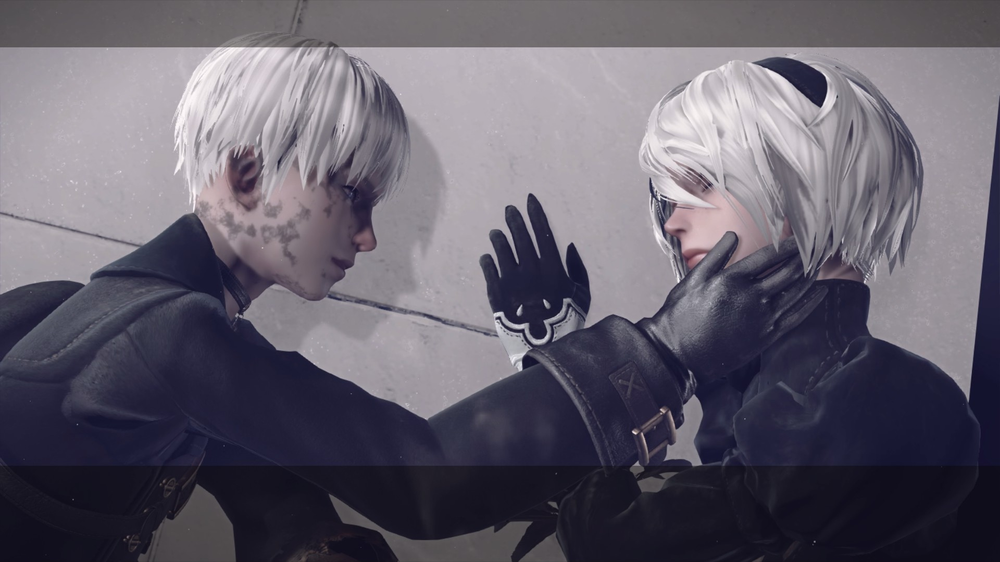
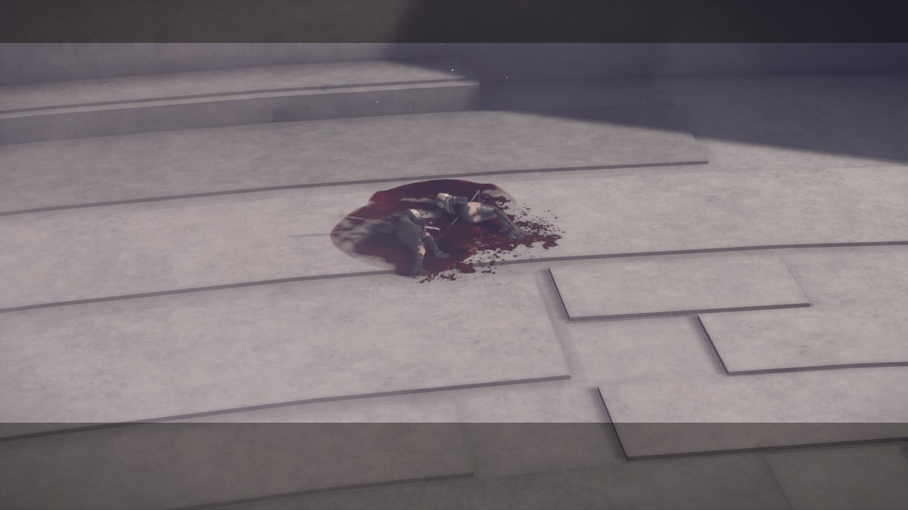
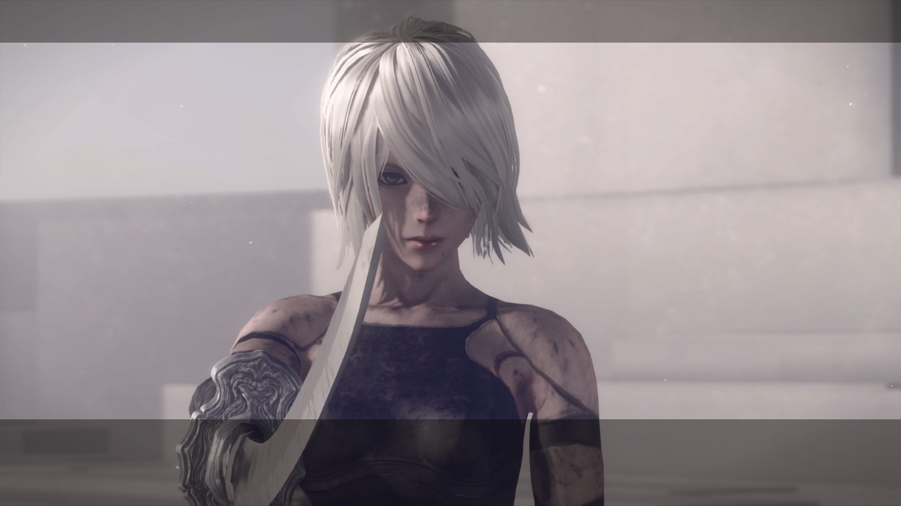

本篇内容含有一定剧透成分

<!--more-->

> **Everything that lives is designed to end.
> We are perpetually trapped
> in a never-ending spiral of life and death.
> Is this a curse?
> Or some kind of punishment?
> I often think about the God who blessed us with this cryptic puzzle
> and wonder if we’ll ever have the chance to kill him."**

> Glory to mankind.

文笔不好就不写评价了，
为了剧情才玩的这个游戏，外加上没有手柄很难调整pod的方向，所以实在忍不了琐碎的跑图加杀不完的怪物时就打开了简单模式+自动芯片。

先把警告说在前头。没玩过这个游戏的人想入手的话一定要谨慎，一旦搞不好你会厌恶这个游戏的操作方式，会吐槽它没有汉化，觉得无穷无尽的打打杀杀毫无意义。

如果你真的不喜欢这款游戏，不代表别人不喜欢，所以不要上网上影响别人，毕竟能找到一个可以让自己彻底的哭一次的机会很难的。

> Every thing that lives is designed to end.

之前一直在思考这句话到底是什么意思。
还是永远不要明白好了。

竟然真的会被一款游戏搞得哭得稀里哗啦的。

为什么要教会孩子们感情呢？恐惧本应该会让他们躲避危险，但迎来的却是他们的自杀。

全都是伪装起来的，人类早已经不存在了，'Glory to mankind'都是骗“人”的，所有的毁灭都是事先设定好的。

不就是绝望么，有啥大不了的

真的好心酸，都在为了结束而努力，但是却迎来的是无休止的战斗，以及悲惨的结局

大概是怕有些人难以接受这个结局才有的E结局吧。他们全都死了我倒是能接受。

想逞强忍住告诉自己做好最坏的打算玩到结局，结局也的确和自己后来想的一样令人心塞，但D结局的音乐响起时忍不住颤着身子哭了起来。

Emotion is prohibited.

三周目开始时2B落在水上都市后感染了病毒，第一次操纵她往目的地走时走慢了，很自责于是重新读档了，我想让她活下来但等她走到桥上感染的程度突然从70%张到90%时才明白这是不可能的了。

买了个内存装电脑上组双通道，应该是兼容性的问题开机后不久就画屏死机，最开始还以为这是游戏的特效

帕斯卡那么的善良，帮助了那么多机器人，为什么要这么对她

我觉得让A2杀死她是最正确的选择吧...

> This can not continue... This can not continue... This can not continue...

> I never quite realized... how beautiful this world is.

很多人都喜欢2B，但我更喜欢A2。

Bunker炸了

Pascal的村庄毁了

前几分钟Pascal说要出去看看这世界，迎面而来的却是村民变成僵尸互相残杀和孩子们因为恐惧而导致的自杀。

连最后的希望都不存在了，Pascal死了。

2B和9S都想彼此在一起，但总有一个要死去。

删档了

> It always... ends like this

