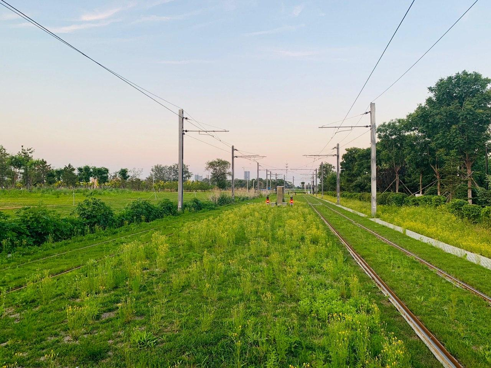

好久没有更新博客了，大一下半年一直在忙各种考试，有幸（大雾）参加了一下辽宁三十多年都没举办过的高数省统考。除此之外还有一堆乱七八糟的事情要忙，更新博客的事就只好一点点往后拖了，于是拖更到了8月，后决定不继续拖更但实在没什么拿得出手的技术类文章可写，正好最近还遇到许多有趣的事情，就整理成日常写在这里吧。
<!--more-->
---

> 现在是00:00， 很适合吹空调听音乐写博客，毕竟白天睡了一天了。

<iframe frameborder="no" border="0" marginwidth="0" marginheight="0" width=330 height=86 src="//music.163.com/outchain/player?type=2&id=493911&auto=0&height=66"></iframe>

首先是6月末去了沈阳META·TRON（梅塔·特隆）电音节，听说这是东北第一次举办的电音节，从AlanWalker入坑的电音，但Meta没请Alan，不过得知有百大DJ前十的DonDiablo（大！菠！萝！）遂非常激动觉得机会难得于是毫不犹豫的就把票买了。

本来临近期末了除了高数和英语和程序这几科没结课就没有别的课了，但实际上因为要准备高数省统考某组织多加了几节高数课搞得每天都要上两三大节的高数，在得知考试提前到6月29号后某部门下通知要求周末不许离校必须参加全天的自习和新增的高数课和高数模拟考试（草——汉语），于是我差点成为了一个花700多块钱打水漂的带傻子。

~~我们受过严格的训练，无论多生气，都不会说脏话，除非憋不住。（此处附和着：对！对！）~~

所以啊没有高考的学弟学妹们你们一定要好好学习！要不然就会~~考上我们东北某黄空黄天停水停电停网不停课的垃圾海洋大学，期中考试过不到一个月就要准备期末考试，而且别的学校的考试周都一两个星期我们的期末考试周一个多月啊！你看别的学校学生都放假回家了你还得等月底的英语期末考试考完才能回家啊！~~（滑稽加狗头保命）

咳咳，我们言归正传，你刚刚说的那个电音节，它High吗？（#啪）

于是6月23号下午考完高数模拟考试就直奔地铁站，临时买了一张沈阳北站到沈阳南站的高铁票，逃掉了晚自习，踏上了**追**(露)**逐**(宿)**梦**(街)**想**(头)的**追**(流)**梦**(浪)之旅。

买高铁票时只剩一张商务座，于是用29元超低价格体验了一次12分钟的商务舱之旅，还享有了商务舱专属候车区的服务，实在没敢问有没有免费咖啡因为怕被骂不要脸（逃

检票时乘务员阿姨像提醒小朋友一样严肃的提醒我下一站就下车，没有返程，要是不下车就坐到大连了哈哈哈哈哈哈（噗

没通地铁于是坐高铁去苏家屯...然后从沈阳南站一路狂奔到有鬼电车一号线的站台，等了将近20分钟才等到车（班次真少），14:00就开始的电音节我20:10才迟到赶到苏家屯的会展中心......

结果完美错过了回沈北的大巴车，于是真要露宿街头了。（叫我去网吧包宿还不如叫我去死，我这都是什么室友啊）

实际是打车到了沈阳站太原街附近找个旅店住了一晚上第二天早起坐地铁然后换乘共享单车（迷）才赶上了第一节的高数课。

~~不用猜就知道肯定有某些爱学习的好孩子们要把这些事和我高数期末成绩不高？联系在一起了。要么就是要有一大群人说我大半夜不准备考试跑出去蹦迪了。~~

---

> 现在是00:49, 不困那就继续写吧

暑假二刷上海，二刷了迪士冶和地铁二号线、地铁四号线、10号线、11号线、16号线和磁悬浮等景点。看了梦寐以求的BiliBili Macro Link，说实话BML的现场和看直播/回放的效果真的不一样，反正·**爱死这破站** 就完了。

总之就是以后绝对不会这么热的天去迪士冶了，要出人命的。

说回来还是喜欢一个人玩，人多了就是特别累，尤其是夏天这个要命的季节。

除此之外还去了杭州，草率的逛了一下很有名的景点，后来因为太累了就回来了。

---

> 01:30 终于把插图选好了

先写这么多，困了，等以后有时间（咕）再补。
