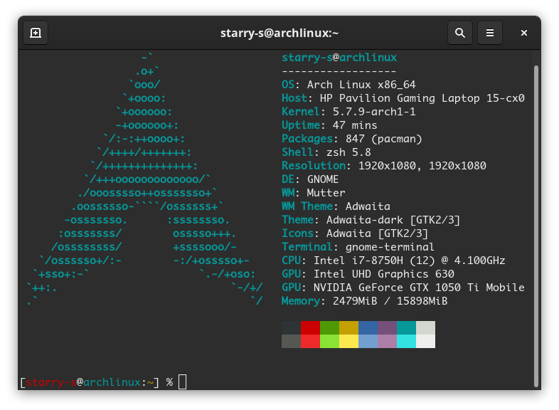

自从高中毕业至今这台笔记本用了将近两年，已经记不清当初为什么买了这台笔记本，刚买来电脑第一次装Arch Linux时遇到了一些坑，不过大多数的问题Google折腾一会或随着后续的软件更新基本上就都解决了，唯独配置双显卡这个问题在用了两年后才算是找到了比较满意的解决方法（大概是），~~尽管现在这电脑已经停产了，就算有人买了这台电脑也不一定会拿他装Arch Linux，不过我还是打算把这个问题的解决过程记录一下~~（本篇讲的方法应该是适用于大多数N卡+i卡的笔记本电脑的，只是有些细节不一样），以备我后续重装系统时有个参考。

<!--more-->

------

<!--aplayer
{
    "name": "Kaleidoscope",
    "artist": "Vicetone / Grace Grundy",
    "theme": "#A26208",
    "url": "https://music.starry-s.me/music/560e_0558_060b_adc45c798222ffa86a4d1a0cb6ddf18f.m4a",
    "cover": "https://music.starry-s.me/music/cover/18671906464338403.jpg"
}
--> 

# 先描述一下踩坑经过

> 本段略微有些废话，可以跳过

记得在刚买来这台笔记本（2018年夏），Linux内核还没升到5.0的时候，使用live CD装系统时会遇到`lspci`卡死，关机的时候会卡死的问题，查系统日记都是一堆ACPI的报错。当时网上查了一下大概是内核和驱动一些bug，没找到解决办法（补充：是nouveau的问题，内核参数添加`modprobe.blacklist=nouveau`禁用可以暂时解决问题），Google到论坛的帖子说是在关机/重启发生卡死时直接长按电源关机就好了，对电脑没有影响（找不到搜的回答了）

装完系统后安装显卡驱动时想通过Bumblebee + bbswitch切换双显卡，于是装了Gnome然后照着wiki配置完Bumblebee后重启电脑直接死机（补充：应该是bbswitch导致的ACPI锁死）。

经过多次重装系统的折磨后，发现只装Bumblebee不装bbswitch不`systemctl enable bumblebeed.service`时，能正常开机，然后之前遇到的两个问题也莫名其妙就好了，即系统重启关机不会卡死，`lspci`也正常了（迷）

之后，在不装bbswitch的情况下，`systemctl enable bumblebeed`再用`optirun`和`primusrun`这种方式用独显运行程序都没有问题。

当时以为电脑不装bumblebee的话就没法正常关机，于是就一直用着bumblebee切换双显卡，玩游戏性能比Windows下差一点（貌似是显卡驱动的锅？），别的都没啥问题。

今年年初买了一块拓展屏想搞双显示器，本来显示器应该插上HDMI直接就能用的，但是因为这电脑的HDMI走的独显输出，Bumblebee不能直接用，wiki上教的创建个intel的虚拟输出啥的方法有试过但是没成功过（不知道是配置文件写错了还是啥问题），于是又Google了一下后disable并卸了Bumblebee改用[NVIDIA Optimus 只使用独显](https://wiki.archlinux.org/index.php/NVIDIA_Optimus#Use_NVIDIA_graphics_only)的方式，这样双显示器倒是能用了，但是如果笔记本只用电池没连着拓展屏的时候还跑着独显这也太费电了。

所以最后找到了能切换显卡的[Optimus Manager](https://github.com/Askannz/optimus-manager)。

# 安装过程

照着[Wiki](https://wiki.archlinux.org/index.php/NVIDIA_Optimus)和Optimus Manager的[README](https://github.com/Askannz/optimus-manager#optimus-manager)。首先安装好显卡驱动相关的软件，如果有Bumblebee的话使用`systemctl disable bumblebeed`停用。

首先清除（记得备份）`/etc/X11/xorg.conf.d/`下的配置文件，并删掉（记得备份）`/etc/X11/xorg.conf`（如果有的话），因为Optimus Manager会自动生成配置文件存放到`/etc/X11/xorg.conf.d/`里面，所以建议安装前把显示配置相关的文件都清除掉。

使用Arch Linux CN源或者通过AUR Helper安装`optimus-manager`。

```
# Arch Linux CN
$ sudo pacman -S optimus-manager
# AUR
$ yay -S optimus-manager
```

因为我用的Gnome，参照[README中说的](https://github.com/Askannz/optimus-manager#important--gnome-and-gdm-users)卸载掉`gdm`并安装`gdm-prime`<sup>AUR</sup>。（国内下载源代码的速度极慢建议挂梯子，或者挂梯子克隆[GDM的代码](https://gitlab.gnome.org/GNOME/gdm)到`~/.cache/yay/gdm-prime/gdm`下。）

修改`/etc/gdm/custom.conf`，移除`WaylandEnable=false`一行前面的`#`禁用Wayland而使用X。

## 修改配置文件

``` 
$ sudo cp /usr/share/optimus-manager.conf /etc/optimus-manager/optimus-manager.conf
```

不要编辑`/usr/share/`下的文件，编辑`/etc/optimus-manager/optimus-manager.conf`，将切换方式设为`switching=none`，不推荐使用bbswitch（见[后续第一条](#Others)），设置`pci_power_control=yes`让PCI Power Management切换显卡。

之后根据需求来修改开机自动选择显卡：

``` conf
startup_mode=auto
startup_auto_battery_mode=intel
startup_auto_extpower_mode=nvidia
```

这里我设置的是用电池时使用集成显卡，用电源时使用独显。

最后贴一下全部的配置文件，除了上述的几处修改以外其他均为默认值，仅供参考。

``` conf
[optimus]

# This parameter defines the method used to power switch the Nvidia card. See the documentation
# for a complete description of what each value does. Possible values :
#
# - nouveau : load the nouveau module on the Nvidia card.
# - bbswitch : power off the card using the bbswitch module (requires the bbswitch dependency).
# - acpi_call : try various ACPI method calls to power the card on and off (requires the acpi_call dependency)
# - custom: use custom scripts at /etc/optimus-manager/nvidia-enable.sh and /etc/optimus-manager/nvidia-disable.sh
# - none : do not use an external module for power management. For some laptop models it's preferable to
#          use this option in combination with pci_power_control (see below).
switching=none

# Enable PCI power management in Intel mode.
# This option is incompatible with acpi_call and bbswitch, so it will be ignored in those cases.
pci_power_control=yes

# Remove the Nvidia card from the PCI bus.
# May prevent crashes caused by power switching.
# Ignored if switching=nouveau or switching=bbswitch.
pci_remove=yes

# Reset the Nvidia card at the PCI level before reloading the nvidia module.
# Ensures the card is in a fresh state before reloading the nvidia module.
# May fix some switching issues. Possible values :
#
# - no : does not perform any reset
# - function_level : perform a light "function-level" reset
# - hot_reset : perform a "hot reset" of the PCI bridge. ATTENTION : this method messes with the hardware
#         directly, please read the online documentation of optimus-manager before using it.
#         Also, it will perform a PCI remove even if pci_remove=no.
#
pci_reset=no

# Automatically log out the current desktop session when switching GPUs.
# This feature is currently supported for the following DE/WM :
# KDE Plasma, GNOME, XFCE, LXDE, Deepin, i3, Openbox, AwesomeWM, bspwm
# If this option is disabled or you use a different desktop environment,
# GPU switching only becomes effective at the next graphical session login.
auto_logout=yes

# GPU mode to use at computer startup. Possible values: nvidia, intel, hybrid, auto
# "auto" is a special mode that auto-detects if the computer is running on battery
# and selects a proper GPU mode. See the other options below.
startup_mode=auto
# GPU mode to select when startup_mode=auto and the computer is running on battery.
# Possible values: nvidia, intel, hybrid
startup_auto_battery_mode=intel
# GPU mode to select when startup_mode=auto and the computer is running on external power.
# Possible values: nvidia, intel, hybrid
startup_auto_extpower_mode=nvidia


[intel]

# Driver to use for the Intel GPU. Possible values : modesetting, intel
# To use the intel driver, you need to install the package "xf86-video-intel".
driver=modesetting

# Acceleration method (corresponds to AccelMethod in the Xorg configuration).
# Only applies to the intel driver.
# Possible values : sna, xna, uxa
# Leave blank for the default (no option specified)
accel=

# Enable TearFree option in the Xorg configuration.
# Only applies to the intel driver.
# Possible values : yes, no
# Leave blank for the default (no option specified)
tearfree=

# DRI version. Possible values : 2, 3
DRI=3

# Whether or not to enable modesetting for the nouveau driver.
# Does not affect modesetting for the Intel GPU driver !
# This option only matters if you use nouveau as the switching backend.
modeset=yes

[nvidia]

# Whether or not to enable modesetting. Required for PRIME Synchronization (which prevents tearing).
modeset=yes

# Whether or not to enable the NVreg_UsePageAttributeTable option in the Nvidia driver.
# Recommended, can cause poor CPU performance otherwise.
PAT=yes

# DPI value. This will be set using the Xsetup script passed to your login manager.
# It will run the command
# xrandr --dpi <DPI>
# Leave blank for the default (the above command will not be run).
DPI=96

# If you're running an updated version of xorg-server (let's say to get PRIME Render offload enabled),
# the nvidia driver may not load because of an ABI version mismatch. Setting this flag to "yes"
# will allow the loading of the nvidia driver.
ignore_abi=no

# Set to yes if you want to use optimus-manager with external Nvidia GPUs (experimental)
allow_external_gpus=no

# Comma-separated list of Nvidia-specific options to apply.
# Available options :
# - overclocking : enable CoolBits in the Xorg configuration, which unlocks clocking options
#   in the Nvidia control panel. Note: does not work in hybrid mode.
# - triple_buffer : enable triple buffering.
options=overclocking

```

# 食用方法

`optimus-manager --switch nvidia`切换到独显（nvidia）

`optimus-manager --switch intel`切换到集显（intel）

安装`mesa-demos`后，使用`glxinfo | grep "OpenGL renderer"`查看当前正使用的显卡

其他用法参见[Usage](https://github.com/Askannz/optimus-manager#usage)。

注意：

 - 切换显卡的过程中会自动注销登录，所以记得**保存并关掉电脑正在运行的程序**。

 - 你可以在配置文件中修改`auto_logout=false`禁止自动注销以手动注销切换显卡。

# Others

 - 之所以不推荐使用`bbswitch`是因为容易遇到**ACPI锁死**的问题，[参考Wiki](https://wiki.archlinux.org/index.php/NVIDIA_Optimus#Lockup_issue_(lspci_hangs))，需要添加[内核参数](https://wiki.archlinux.org/index.php/Kernel_parameters)`acpi_osi=! acpi_osi="Windows 2009"`或`acpi_osi="!Windows 2015"`启动，如果你遇到了锁死可以通过开机时在[启动加载器界面](https://wiki.archlinux.org/index.php/Arch_boot_process#Boot_loader)编辑添加内核参数来正常进入系统，如果你用的是efistub或者没办法编辑内核参数的话就只能用live CD救你的电脑了。

 - 如果用不了`lspci`，电脑没法正常关机的话，是nouveau的问题，可添加内核参数`modprobe.blacklist=nouveau`禁用。

 - 因为前几天改配置文件时又踩了一遍锁死的坑，于是拿着相机内存卡（我U盘放学校寝室里拿不出来了）做了最新的(2020.07.01)live CD救砖时，惊喜的发现在live环境下`lspci`和关机都不会卡死了，~~貌似是新版内核驱动修复了nouveau的问题~~ 应该是我在几个月前升级了电脑的Bios解决的这个问题，因为我又新下了一个旧的live CD，关机和lspci也都正常了（算了不管到底是怎么回事了，能用就行

 - 在切换显卡自动注销后，gdm界面不会自动加载出来而是一直黑屏，这时需要手动切换到tty2再切回tty1才能加载出来，貌似是gdm-prime的问题。

-----


