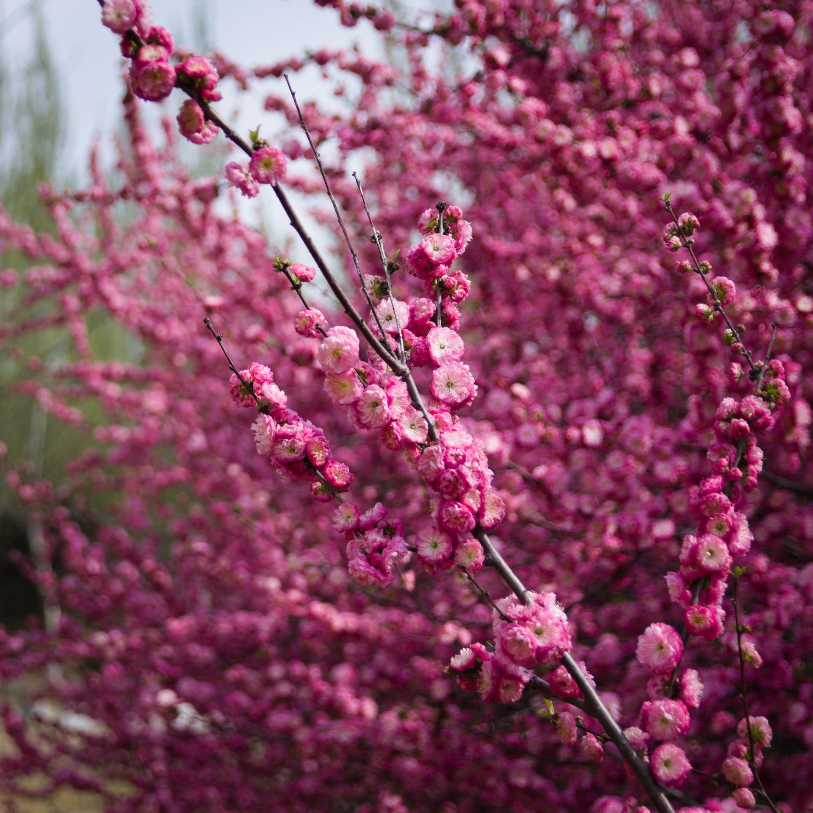

咱去年忘了更新这个系列...

<!--more-->

<!--aplayer
{
    "name": "愚カシイ机械",
    "artist": "岡部啓一 / 石濱翔 / 帆足圭吾 / 高田龍一",
    "theme": "#aa6666",
    "url": "https://music.starry-s.me/music/f47cbf8a517c72c16b5eff614cd78ace.m4a",
    "cover": "https://music.starry-s.me/music/cover/2522279674184572.png"
}
-->

------

前一阵子买了二手的适马17-50 f2.8镜头，在网上看这镜头很适合新手学摄影，而且这个焦段+大光圈适用的范围也很广。遂把在家吃灰了一年的相机带回学校，打算找时间拍点风景照片。

实际上买完新镜头后我就拿它拍了几张花的照片后也没怎么出过门，因为照片拍得比较少，所以只好先挑几张好看的微距照片贴到博客上面，以后有机会拍到更好的照片后再更新。

> 仅使用Raw Therapee对照片进行了裁剪并调整颜色

------

# Spring - 4
