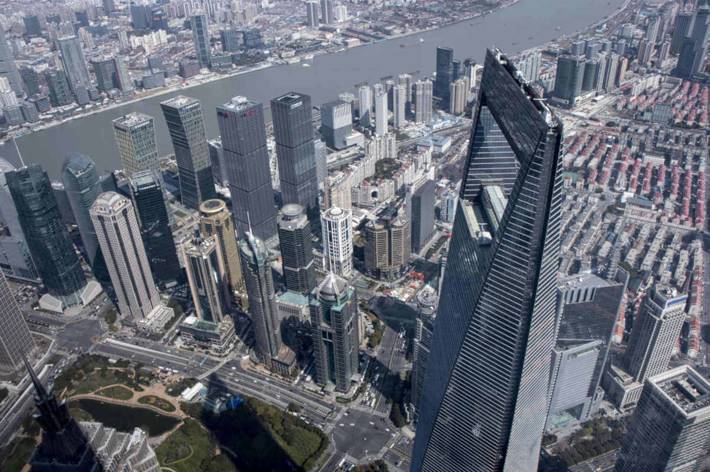
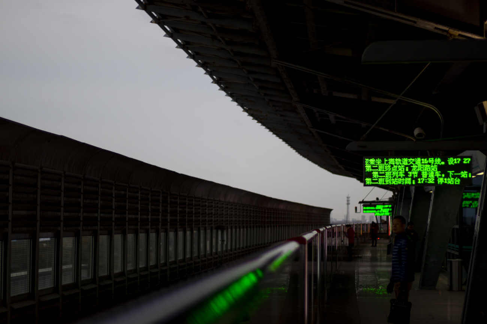

多图预警

<!--more-->

最后更新日期：2019年5月19日 19:59 

---

<iframe frameborder="no" border="0" marginwidth="0" marginheight="0" width=530 height=86 src="//music.163.com/outchain/player?type=2&id=1313107868&auto=1&height=66"></iframe>

话说多了除了自己觉得爽以外似乎没什么有趣的地方。

所以我删掉了没用的东西。

---

<iframe frameborder="no" border="0" marginwidth="0" marginheight="0" width=330 height=86 src="//music.163.com/outchain/player?type=2&id=409931671&auto=0&height=66"></iframe>

我也不知道我为什么会喜欢地铁这个东西，不过还好我现在对它不感兴趣了。

---

---

<iframe frameborder="no" border="0" marginwidth="0" marginheight="0" width=430 height=86 src="//music.163.com/outchain/player?type=2&id=468490569&auto=0&height=66"></iframe>

对，我对迪士尼也不感兴趣。

我只不过是听别人说迪士尼很出名才去的。

---

---

要是身边能有人陪我一起该多好。

---

---

---

---

---

所以废了好长时间才把这些写出来，最开始是没想把这次旅行写在Blog里的，但是想了很久又有些不甘心。

然而最后我又把写在这里的内容全部删除掉了，希望以后我不会因为删除掉了这些内容而生气吧。

---
