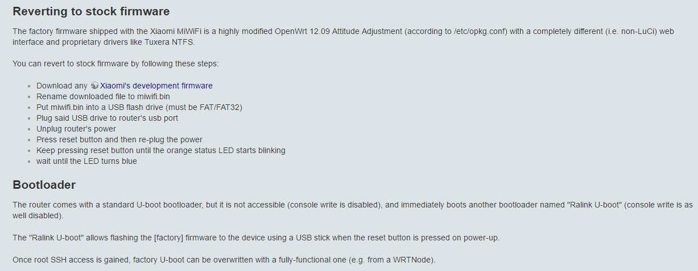

前不久家里新添一台小米路由器Mini,本着更好的发挥路由器的性能的态度去折腾，于是就有了这篇文章。

<!--more-->

> 本篇于2017年3月5日重写。
> 最后更新时间: 2018年2月18日。

# 此教程基于Openwrt/LEDE官网的资料写出

英语好的话可以去[openwrt官网](https://openwrt.org)的Wiki和Support devices中了解一下openwrt以及找小米路由器mini的刷机教程看一下，很有用的。

就目前来讲[小米路由器mini的LEDE Wiki页面](https://lede-project.org/toh/hwdata/xiaomi/xiaomi_mini_v1)仍在建设当中。

> OpenWrt是适合于嵌入式设备的一个Linux发行版。
相对原厂固件而言，OpenWrt不是一个单一、静态的固件，而是提供了一个可添加软件包的可写的文件系统。这使用户可以自由的选择应用程序和配置，而不必受设备提供商的限制，并且可以使用一些适合某方面应用的软件包来定制你的设备。对于开发者来说，OpenWrt是一个框架，开发者不必麻烦的构建整个固件就能得到想要的应用程序；对于用户来说，这意味着完全定制的能力，与以往不同的方式使用设备，OPKG包含超过3500个软件。
默认使用Luci作为web交互界面。

小米路由器mini是一个支持802.11ac+bgn的无线路由器，使用联发科MT7620A处理器，它有3个网络接口以及两根天线，(one SoC-based 2.4 GHz 802.11bgn and one MT7612E-based 5GHz 802.11ac, both 2x2 MiMo).

> 参数：
> CPU： MT7620A
> 频率： 580MHZ
> 内存： 16+128Mb
> 接口： 100M x 3 + usb2.0 x 1

 ** 小米发布此款路由器时声称路由器使用的是千兆的网口，实际上是为百兆网口，并非所谓的千兆网口 **

# 准备工作：开启路由器SSH



小米路由器刷机是极其简洁快速的，小米处于安全考虑并未给路由器开启SSH，Openwrt官网上说想开启小米路由器mini的ssh是很难弄的。毕竟外国人看不懂汉语而且小米还没有准备英文版的网页（就是小米增添了许多纸张一样的反人类的设置）······

开启ssh权限首先需要路由器安装[开发版固件](http://miwifi.com/miwifi_download.html)。

 **刷开发版固件的教程**  请参考官方的[刷机教程](http://bbs.xiaomi.cn/t-11720354)

只有安装开发版固件才可以开启路由器SSH然后再进行刷机等后续操作。

找到小米路由器官网的开启[ssh工具](http://d.miwifi.com/rom/ssh)登陆小米账号，下载`miwifi_ssh.bin`，同时，记下root密码。

> 按照上述的刷机方法再将`miwifi_ssh.bin`刷入系统中。注意:这一次文件名为miwifi_ssh.bin。

路由器开机，SSH到路由器。

``` bash
# ssh root@192.168.31.1
```
> Windows用户可使用putty与路由器进行ssh通信：
> 打开putty，host name处输入路由器网关：192.168.31.1，端口号为22，点击open。

 **有常识的人都懂，Linux终端在输入密码时不会显示"\*" 。别担心你的键盘没坏。**

# 刷机

建议在刷机前[备份一下原厂固件](https://blog.phpgao.com/xiaomi_router_uboot.html#备份硬件信息)防止意外发生。

首先刷入Bootloader：

可以选择[hackpascal](http://www.right.com.cn/forum/thread-161906-1-1.html)制作的[breed](http://breed.hackpascal.net/)（推荐）

除此之外还有Pandorabox官方的u-boot，功能较上一个少很多。[下载地址](http://downloads.openwrt.org.cn/PandoraBox/Xiaomi-Mini-R1CM/u-boot/)

ssh到路由器输入命令：

```
# cd /tmp/
# wget "你复制好的breed的下载链接"

# mtd -r write "/tmp/下载好的Uboot"  Bootloader
```
刷入过程 **不要动路由器** ，过几分钟路由器会重启，U-boot刷入成功。

用细铁丝怼住路由器Reset键后接通电源，开机后用网线将路由器与电脑相连，打开浏览器输入网址：`192.168.1.1`，选择下载好的固件刷入路由器。

> 如果无法进入breed后台试着将网络连接设置改为手动，ip地址改为192.168.1.2后再试试。

# 推荐几款比较好的固件：

## LEDE

除了以上几种固件性能表现很好以外，最近出的LEDE也是很好的一款固件呢。可以参考我的[这篇博客](http://blog.starry-s.xyz/posts/psg1218-lede/)进行配置。[下载链接](https://downloads.lede-project.org/releases/17.01.4/targets/ramips/mt7620/) (17.01.4)。

> ~~LEDE Unsupported: Wifi partially working, especially 802.11AC is not stable (yet)~~
> ~~尚未解决的问题: Wifi偶尔抽风，尤其是802.11AC很不稳定。~~

## 潘多拉 PandoraBox

可以根据需要选择[老版本固件](http://downloads.openwrt.org.cn/PandoraBox/Xiaomi-Mini-R1CM/)或者2017年最新编译出来的[固件](http://www.pandorabox.com.cn/pandorabox-16-10-stable/targets/ralink/mt7620/)，找到对应型号后下载。

Pandorabox默认密码为:admin

## pandavan

更多信息[点击此处](http://www.right.com.cn/forum/thread-161324-1-1.html)获取。

## Openwrt

OpenWrt已与LEDE合并，可以在OpenWrt官网下载旧版的OpenWrt固件或者下载新版的Lede固件。

---

# 除此之外还可以在硬件方面改(po)装(huai)路由器:

[小米路由器mini之改装天线散热](http://blog.starry-s.xyz/posts/xiaomi-mini-fan-2/)

----
配置路由器方面，请参照[斐讯K2折腾之——安装LEDE](http://blog.starry-s.xyz/posts/psg1218-lede/)这篇文章进行配置。

<br/>

推荐一些资料：

* [老高的技术博客](https://blog.phpgao.com/xiaomi_router.html)
* [OpenWrt Wiki](http://wiki.openwrt.org/zh-cn/start)
* [OpenWrt-dist](http://openwrt-dist.sourceforge.net/)
* [Xiaomi WIFI Mini | OpenWrtWiki](http://wiki.openwrt.org/toh/xiaomi/mini)

<br/>
<br/>
<br/>

# Xiaomi Wifi Mini
