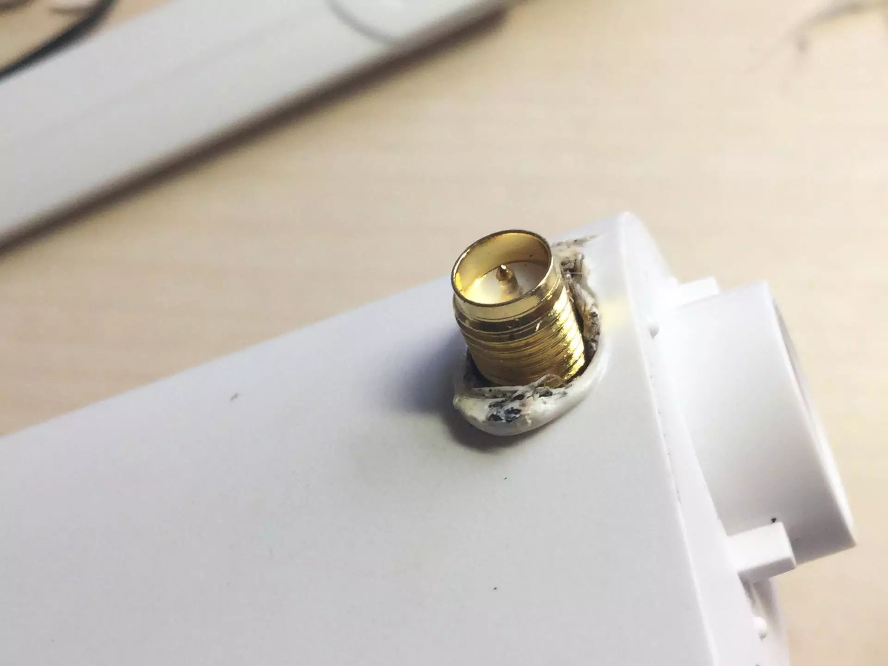

# 小米路由器mini换天线与散热片的安装

小米路由器的cpu为MT7620A，控制5G的芯片为MT7612EN。这两个芯片的发热量还是很大的。小米在路由器中放了一大块铁片并贴上导热硅脂，将热量导到铁板上散发掉。但是毕竟铁板被封在了厚厚的塑料壳内，散热效果中规中矩吧。所以开始拆机动手瞎弄。

<!--more-->

>最后更新：2017年2月26日

----

> 准备工具：
> 散热片，ipex转SMA线，5G天线两根。
> 以及其他的热容胶，电烙铁等。

散热方面：某宝散热片一大堆，价格便宜。我买的是37mm\*37mm\*24mm的大散热片，几个14\*14\*6mm的小散热片，以及一些厚一点的硅脂垫，一个12v的4cm显卡风扇。

天线：小米路由器mini有ipex接口，所以不需要额外的焊接工作。只需两根ipex转SMA的线（20cm左右）以及支持5G信号的天线。

# 拆机

打开外壳，拆掉所有的螺丝，取下主板就剩下大大的~~配重用的~~铁片了······翘掉外壳上的铁片。再打开路由器的屏蔽罩，去掉贴在CPU上面的硅脂。

用电烙铁在外壳上烫出一个比散热片尺寸大一点的的窟窿。把边缘磨平一些。

把风扇焊到电源接口上，电源接口输出电压为DC12V，我在风扇的电路中串联了一个电阻防止风扇短路时烧坏电源变压器。裸露的电源线可以用热缩管包上。

把主板扣在路由器上端外壳上，将散热硅脂垫贴在CPU和5G信号的芯片上。压上散热片，立即用热容胶固定。

在散热片顶端粘上风扇。

# 改装它的天线

拆掉原装天线（暴力一点），拆下后找点美观的东西把天线位置的大窟窿堵上。

然后再用电烙铁在路由器顶部烫两个窟窿（刚好够SMA接口伸出去）。用热容胶固定.

装上外壳后测试一下路由器还活着没。然后断电继续操作。

# Done
