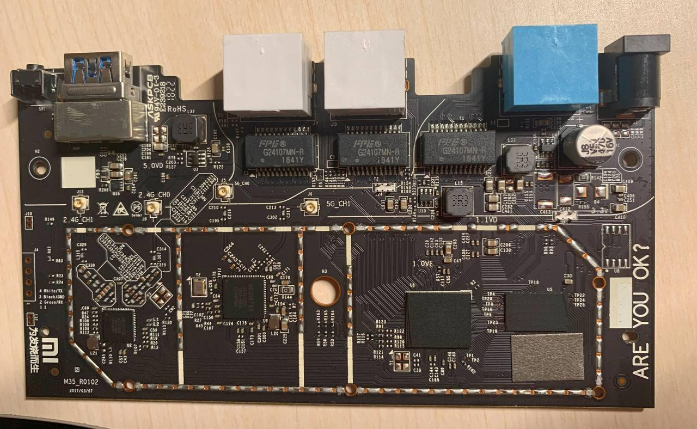
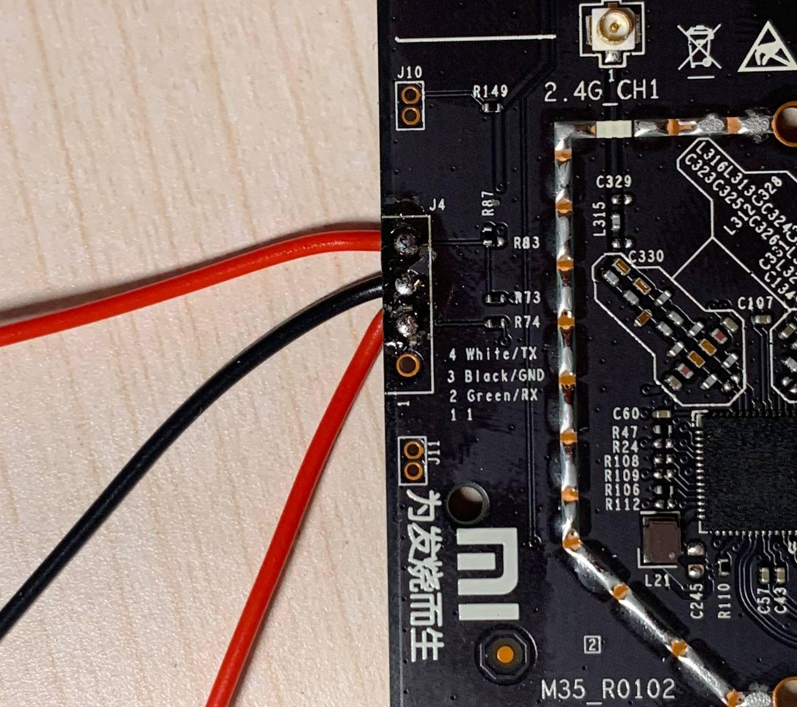

# 砖了

本来路由器闲置了一年了都没咋用了，前两天想把OpenWrt系统刷回原厂系统。

然鹅刷原厂固件时忘记改环境变量了，因为第三方Boot Loader也被我顺带刷回了原厂的所以现在开机无限重启。

之前买单片机套件时赠了一条usb转ttl线的，但是被我放学校了。只好再从万能的某宝再买一条线，尝试着救砖了。

(在某宝发现了一家店啥元件都有，还特别便宜。于是我还顺带买了很多杜邦线、电阻、LED灯、面包板等小玩意...)

<!--more-->

<!--aplayer
{
    "name": "crescent in the sky",
    "artist": "Stepan Voles",
    "theme": "#2233ee",
    "url": "https://music.starry-s.me/music/396e_a80d_10de_076d0b69c03bd2673595bd17ce939f69.mp3",
    "cover": "https://music.starry-s.me/music/cover/1379887099097990.jpg"
}
-->

--------

# 拆机



> 北方冬季气候干燥，拆机时记得放静电，找根铁丝把自己连地线上 (找个金属外壳是接地的电器和自己连上也行)。

拆开路由器外壳，卸下主板，顺手拆掉了散热片（屏蔽罩）。

串口在图片上主板的左侧，旁边有标记，从上到下依次是`TX`、`GND`、`RX`、`1`。需要注意的是主板上的`TX`要接到usb串口的`RX`，主板上的`RX`要接到usb串口的`TX`，`GND`连`GND`，VCC不用连。为了防止接错线，小米还十分贴心的标注了每个接口对应的连接线的颜色。



找出家里吃灰好几年差点被我扔掉的电烙铁，刮刀头刮了半天电烙铁才上锡，把新买的杜邦线母线焊到主板上，和ttl串口线相连。

(电烙铁太破了根本焊不上锡，焊得很丑，emmm)

实际上可以买个4PIN单排针焊上去，把串口接到排针上就可以，我直接把电线焊到上面以后用起来会很麻烦。

# 刷机

> 以下部分基于Arch Linux，其他系统的操作方式可能不一样（例如Windows可能需要超级终端访问串口，再想办法开一个tftp服务器）
> 刷机的原理: 通过ttl串口线连接路由器的主板，让路由器访问电脑上的tftp服务器，刷第三方Boot Loader。

1. 首先电脑上装一个tftp服务器。

  ```
  $ sudo pacman -S tftp-hpa
  $ sudo systemctl start tftpd.service
  ```

  tftp的默认目录为`/srv/tftp`。

  这里使用HackPascal制作的Breed（第三方Boot Loader），[下载链接](https://breed.hackpascal.net/)，把下载好的Breed重命名为`breed.bin`，复制到tftp的默认目录。

  ```
  $ cd /srv/tftp
  $ sudo cp ~/Downloads/breed-mt7620-xiaomi-r3g.bin breed.bin
  ```

2. 路由器插网线连电脑，设置静态ip地址192.168.1.3/24，将串口和电脑连接，先不给路由器通电，通常情况下usb串口的设备名称为`/dev/ttyUSB0`，如果不确定的话可以`dmesg`查一下。

3. 使用`screen`连接串口，波特率为115200。

  ```
  $ sudo pacman -S screen
  $ sudo screen /dev/ttyUSB0 115200
  ```
  
  路由器通电，终端上会显示路由器启动的信息，等几秒后在选择启动项的时候按9，通过TFTP加载Boot Loader。

  > 如果串口在连接到电脑的情况下主板通电时没有响应，那就断开usb串口先给主板通电后再连接串口。
  > (我语文不好别骂我)
  > 如果路由器没有变砖可以正常启动（蓝灯长亮），在正常开机过程中不能选择启动项。此时可以尝试在路由器开机后长按reset按钮7s以上直到主板重启，便可以选择启动项。

  ``` text
  Please choose the operation: 
   1: Load system code to SDRAM via TFTP. 
   2: Load system code then write to Flash via TFTP. 
   3: Boot system code via Flash (default).
   4: Entr boot command line interface.
   7: Load Boot Loader code then write to Flash via Serial. 
   9: Load Boot Loader code then write to Flash via TFTP. 

  You choosed 9
   
  9: System Load Boot Loader then write to Flash via TFTP. 
  Warning!! Erase Boot Loader in Flash then burn new one. Are you sure?(Y/N)y
  ```

  之后设置路由器主机地址（192.168.1.1）和TFTP服务器地址(192.168.1.3)以及文件名称(breed.bin)。

  ``` text
  Please Input new ones /or Ctrl-C to discard
            Input device IP (192.168.31.1) ==:192.168.1.1
            Input server IP (192.168.31.3) ==:192.168.1.3
            Input Uboot filename (uboot.bin) ==:breed.bin
  ```
  
  按回车后开始刷机，过几秒钟后路由器会自动重启，第三方Boot Loader刷写完成。

  路由器断电，长按reset键的同时通电开机，灯闪烁后打开浏览器输入网址`http://192.168.1.1`便可访问breed后台。

# Done

第三方Breed刷完后，先用Breed刷小米官方的开发版固件，开启ssh，之后按照[小米路由器3G折腾之刷OpenWrt记录](/posts/Xiaomi_Miwifi_3G/#使用Breed的刷机方法)这篇文章刷OpenWrt。

``` text
BusyBox v1.19.4 (2018-10-29 07:52:03 UTC) built-in shell (ash)
Enter 'help' for a list of built-in commands.

 -----------------------------------------------------
       Welcome to XiaoQiang!
 -----------------------------------------------------
  $$$$$$\  $$$$$$$\  $$$$$$$$\      $$\      $$\        $$$$$$\  $$\   $$\
 $$  __$$\ $$  __$$\ $$  _____|     $$ |     $$ |      $$  __$$\ $$ | $$  |
 $$ /  $$ |$$ |  $$ |$$ |           $$ |     $$ |      $$ /  $$ |$$ |$$  /
 $$$$$$$$ |$$$$$$$  |$$$$$\         $$ |     $$ |      $$ |  $$ |$$$$$  /
 $$  __$$ |$$  __$$< $$  __|        $$ |     $$ |      $$ |  $$ |$$  $$<
 $$ |  $$ |$$ |  $$ |$$ |           $$ |     $$ |      $$ |  $$ |$$ |\$$\
 $$ |  $$ |$$ |  $$ |$$$$$$$$\       $$$$$$$$$  |       $$$$$$  |$$ | \$$\
 \__|  \__|\__|  \__|\________|      \_________/        \______/ \__|  \__|


root@XiaoQiang:~# 

```